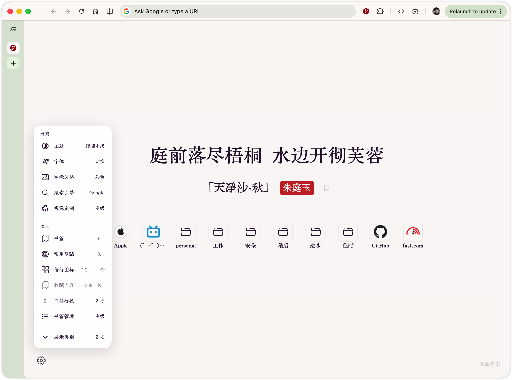
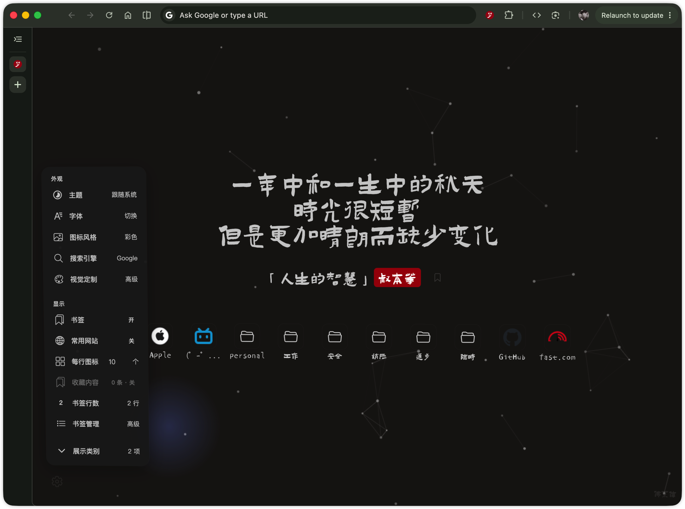
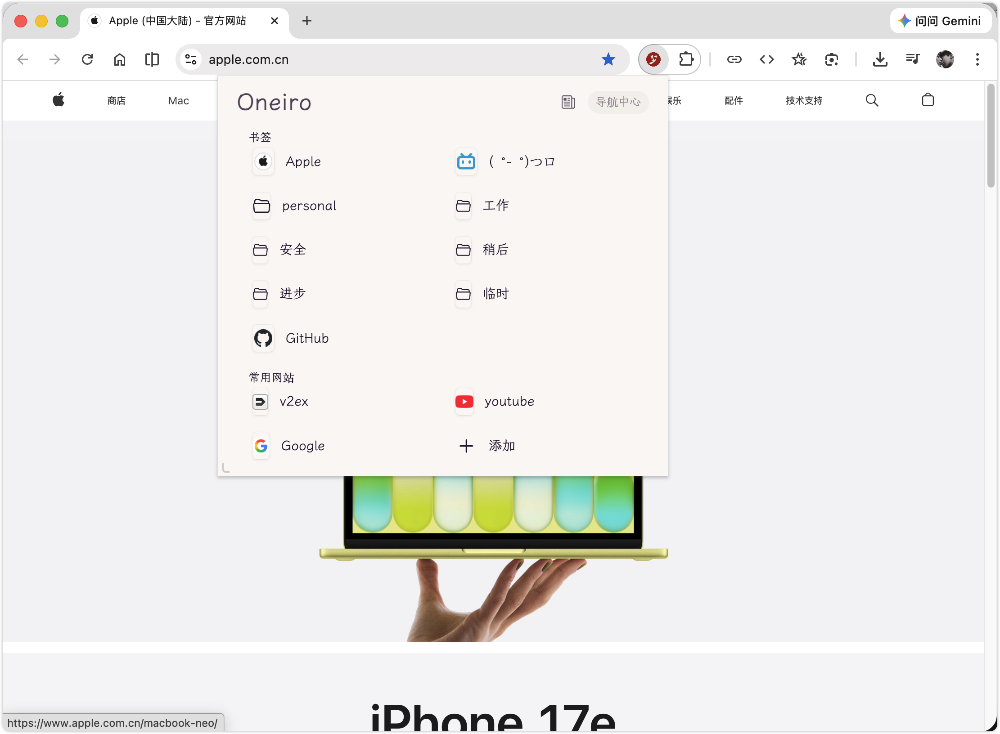

<p align="center">
  
</p>

<h1 align="center">Oneiro</h1>

<p align="center">一款以诗词与书签为核心的浏览器新标签页扩展。</p>

<p align="center">
  <a href="https://github.com/zzhorc/Oneiro/releases">下载 Release</a>
  ·
  <a href="#安装">安装</a>
  ·
  <a href="#使用说明">使用说明</a>
</p>

## 预览





## 功能

### 诗词

- 使用内置的多类别文案数据；可在设置中选择展示类别。
- 点击标题、出处或作者可用所选搜索引擎检索；支持百度、Google、Bing 与 DuckDuckGo。
- 可收藏文案，并切换为仅展示收藏内容。

### 书签与常用网站

- 读取浏览器书签栏，并在书签变更时更新显示；支持多层文件夹展开。
- 图标支持彩色网站图标、黑白图标和首字三种样式。
- 可设置书签显示行数（1–4）和图标网格每行最大数量（3–12，默认 9）；空间不足时会自动收起并可展开查看。
- 常用网站可添加、编辑、删除，并自动使用对应网站图标。
- 扩展弹窗提供网格、杂志、列表三种浏览方式；书签管理可检测重复项、建立自定义分组及归档书签。

### 外观与偏好

- 浅色、深色与跟随系统主题；内置 7 种中文字体。
- 提供高级视觉定制：背景色、渐变或本地图片；文字排版与间距；玻璃效果、阴影、粒子、光晕、视差和浮动动效。
- 设置与常用网站保存在浏览器本地存储中。

> 书签管理中的“归档”和“删除重复项”会操作浏览器的实际书签，请确认后再执行。

## 使用说明

打开新标签页即可使用。左下角齿轮可调整主题、字体、展示内容和书签布局；点击浏览器工具栏中的 Oneiro 图标可打开独立导航面板。

常用网站支持右键编辑或删除。书签和常用网站过多时，点击区域下方的箭头展开或收起。



## 安装

### 从 Release 安装

在 [Releases](https://github.com/zzhorc/Oneiro/releases) 下载对应浏览器的压缩包并解压。

| 浏览器  | 加载方式                                                                                                   |
| ------- | ---------------------------------------------------------------------------------------------------------- |
| Chrome  | 打开 `chrome://extensions/`，开启“开发者模式”，选择“加载已解压的扩展程序”，再选择 `chrome-mv3` 文件夹。    |
| Edge    | 打开 `edge://extensions/`，开启“开发人员模式”，选择“加载解压缩的扩展”，再选择 `edge-mv3` 文件夹。          |
| Firefox | 打开 `about:debugging#/runtime/this-firefox`，选择“临时载入附加组件”，再选择 `firefox-mv2/manifest.json`。 |

Firefox 的临时扩展会在浏览器关闭后卸载，需要重新加载。

### 从源码构建

```bash
pnpm install

# Chrome / Edge
pnpm build

# Firefox
pnpm build:firefox
```

构建结果位于 `.output/chrome-mv3/` 或 `.output/firefox-mv2/`。

## 开发

```bash
pnpm dev
```

技术栈：WXT、React、Tailwind CSS 4、DaisyUI。

## 更新

### v2.4.1

- 修复设置菜单部分中文在裁剪字体下显示异常的问题。
- 更新浅色与深色主题预览图。

### v2.4.0

- 书签和常用网站支持设置图标网格每行最大数量（3–12）。

## 致谢

本项目基于 [xxnuo/jizhi-mod](https://github.com/xxnuo/jizhi-mod) 二次开发，灵感来自 [unicar9/jizhi](https://github.com/unicar9/jizhi)。字体来自 [中文网字计划](https://chinese-font.netlify.app/)。

## License

[MIT](LICENSE)
